[](https://github.com/srib1997)

# school_elective_beacon

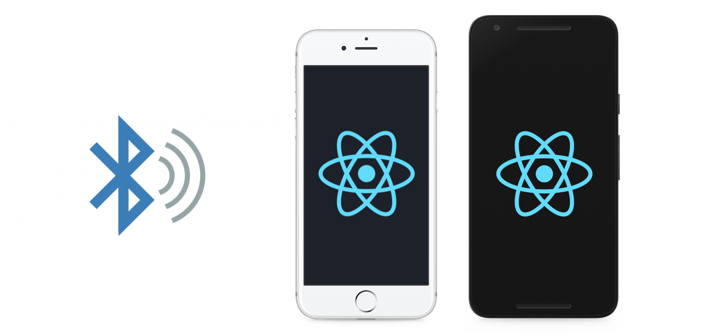

- [安裝所需要的軟件(安裝所需要的 package之前這以下的軟件要先安裝)](#安裝所需要的軟件)
  - [Xcode](#xcode)
  - [AndroidStudio](#androidstudio)
  - [Homebrew](#homebrew)
  - [Nodejs](#nodejs)
  - [Yarn](#yarn)
  - [React Native](#react-native)
  - [Java](#java)
  - [Cocoapods](#cocoapods)

- [安裝所需要的 package](#安裝所需要的package)
  - [ios](#ios)
  - [android](#android)

- [用到的 package 連結](#用到的package連結)
  - [react-native-ble-plx](https://github.com/Polidea/react-native-ble-plx)
  - [react-native-navigation](https://github.com/wix/react-native-navigation)
  - [native-base](https://github.com/GeekyAnts/NativeBase)
  - [react-native-beacons-manager](https://github.com/MacKentoch/react-native-beacons-manager)
  - [react-native-vector-icons](https://github.com/oblador/react-native-vector-icons)
  - [react-native-youtube](https://github.com/inProgress-team/react-native-youtube)
  - [react-native-webview](https://github.com/react-native-community/react-native-webview)

- [先體驗 App 的結果](#體驗App的結果)

- [生成 app 上傳](#生成app上傳)
  - [ios bundle](#iosbundle)
  - [android bundle](#androidbundle)

---

## 安裝所需要的軟件

## 如果在 terminal 輸入指令出現 Permission denied error， 在指令最前輸入 sudo，然後等會會叫你輸入電腦密碼

## Xcode

- [網站](https://yarnpkg.com/lang/en/docs/install/#mac-stable)

只有 mac 機可以安裝，請在 app store 下載

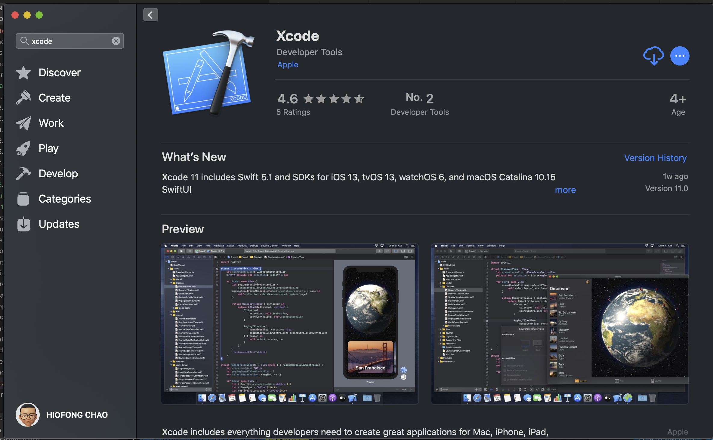


---

## AndroidStudio

- [網站](https://developer.android.com/studio)

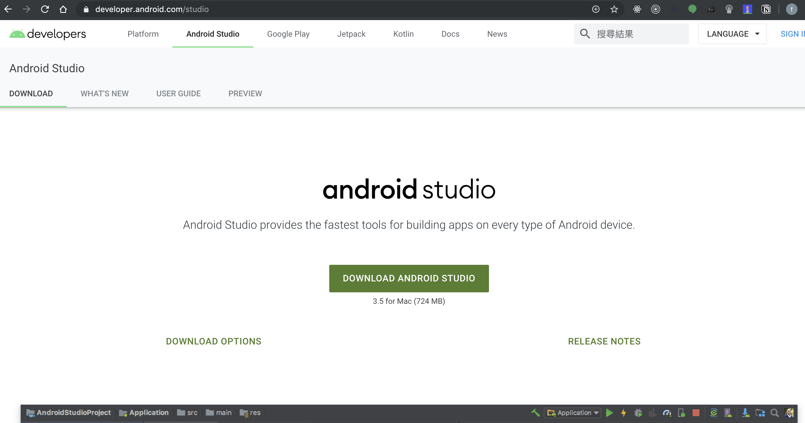

---

## Homebrew

- [網站](https://brew.sh/)

在 terminal 輸入了以下程式碼，然後按下回車

```
/usr/bin/ruby -e "$(curl -fsSL https://raw.githubusercontent.com/Homebrew/install/master/install)"
```

---

## Nodejs

- [網站](https://nodejs.org/en/)

下載 10.16.3 的 version


---

## Yarn


- [網站](https://yarnpkg.com/lang/en/docs/install/#mac-stable)

在 terminal 輸入了以下程式碼，然後按下回車

```
brew install yarn
```

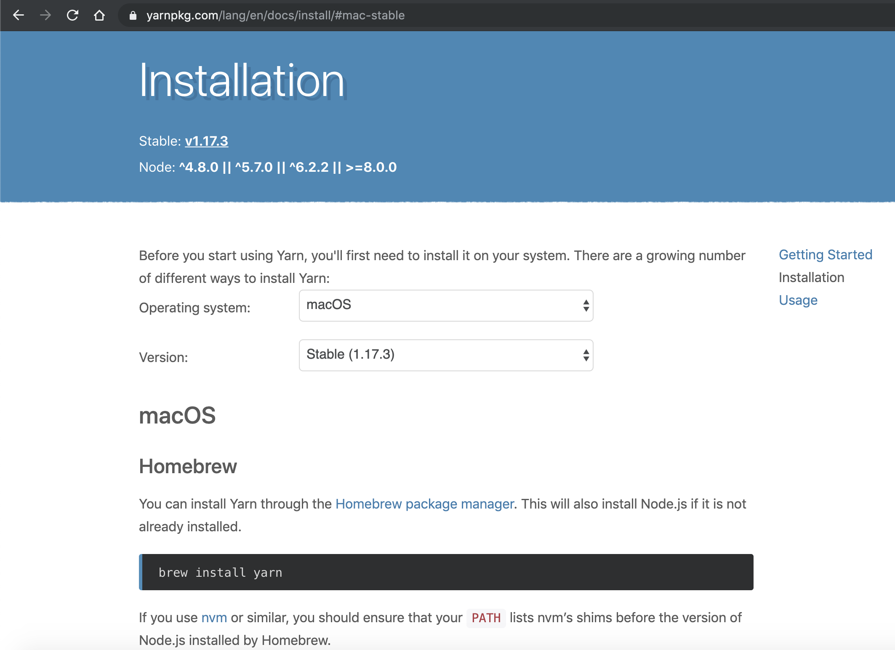

---

## React-Native

在 termainl 中輸入以下程式碼，然後按下回車

```
brew install watchman && brew tap AdoptOpenJDK/openjdk && brew cask install adoptopenjdk8
```

在 termainl 中運行以下命令：

```
npm install -g react-native-cli
```

---

## Java

- [網站](https://www.oracle.com/technetwork/java/javase/downloads/jdk8-downloads-2133151.html)

請下載自己電腦所對應的版本


---

## Cocoapods

- [網站](https://cocoapods.org/)

在 terminal 輸入

```
sudo gem install cocoapods
```

---

## 安裝所需要的package

確保 terminal 路徑是在當前文件夾根目錄下,在 termainl 中輸入以下程式碼，然後按下回車

pwd 是顯示當前路徑的指令

例如： 我的電腦用户叫 srib ，然後我在桌面創建了 school_elective_beacon 文件夾，如果輸入了以下程式碼，然後按下回車，最後會顯示的是 /Users/srib/Desktop/school_elective_beacon 

```
pwd
```

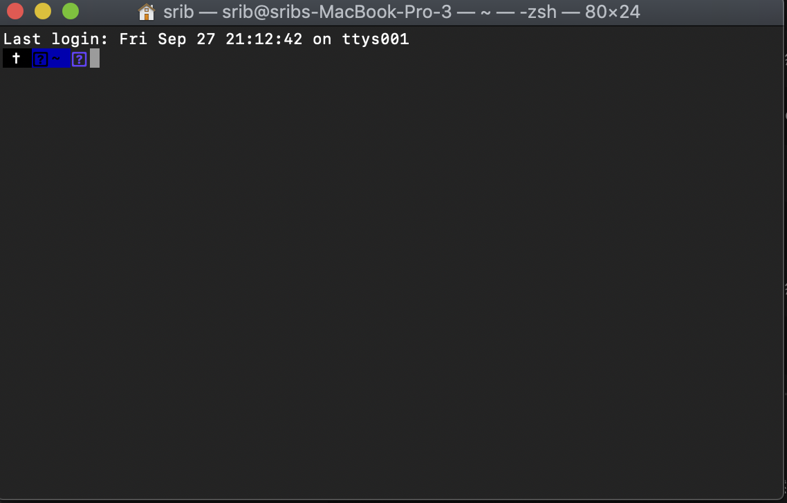

---

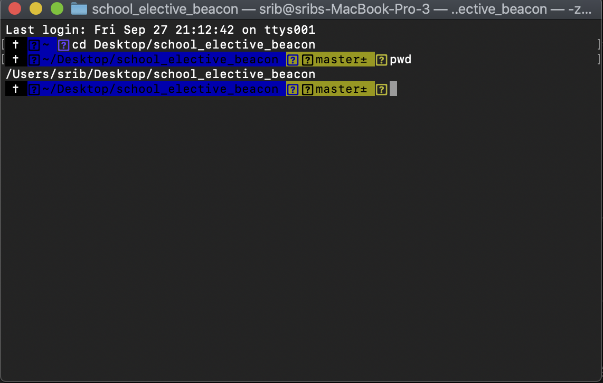

---

開一個新項目叫 school_elective_beacon，在 termainl 中輸入以下程式碼，然後按下回車

```
react-native init school_elective_beacon --version=0.60.5 && cd school_elective_beacon
```

頁面轉換的 package, 在 termainl 中輸入以下程式碼，然後按下回車
```
yarn add react-native-gesture-handler react-native-reanimated react-native-screens react-navigation react-navigation-stack react-navigation-tabs
```

Icon 圖像的 package, 在 termainl 中輸入以下程式碼，然後按下回車
```
yarn add react-native-vector-icons
```

頁面排版的 package, 在 termainl 中輸入以下程式碼，然後按下回車
```
yarn add native-base
```

查找 beacon 的 package, 在 termainl 中輸入以下程式碼，然後按下回車
```
yarn add react-native-beacons-manager react-native-ble-plx
```

顯示 youtube 的 package, 在 termainl 中輸入以下程式碼，然後按下回車
```
yarn add react-native-youtube react-native-webview
```

```
react-native link react-native-beacons-manager
```

```
react-native link react-native-ble-plx
```
---

## IOS

打開 xcode 軟件，在右下按 open another probject, 選擇 ios 裏面的 school_elective_beacon.xcworkspace

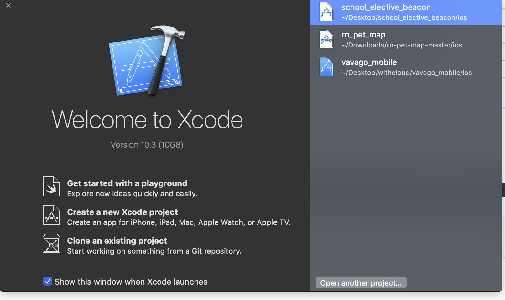

按 open

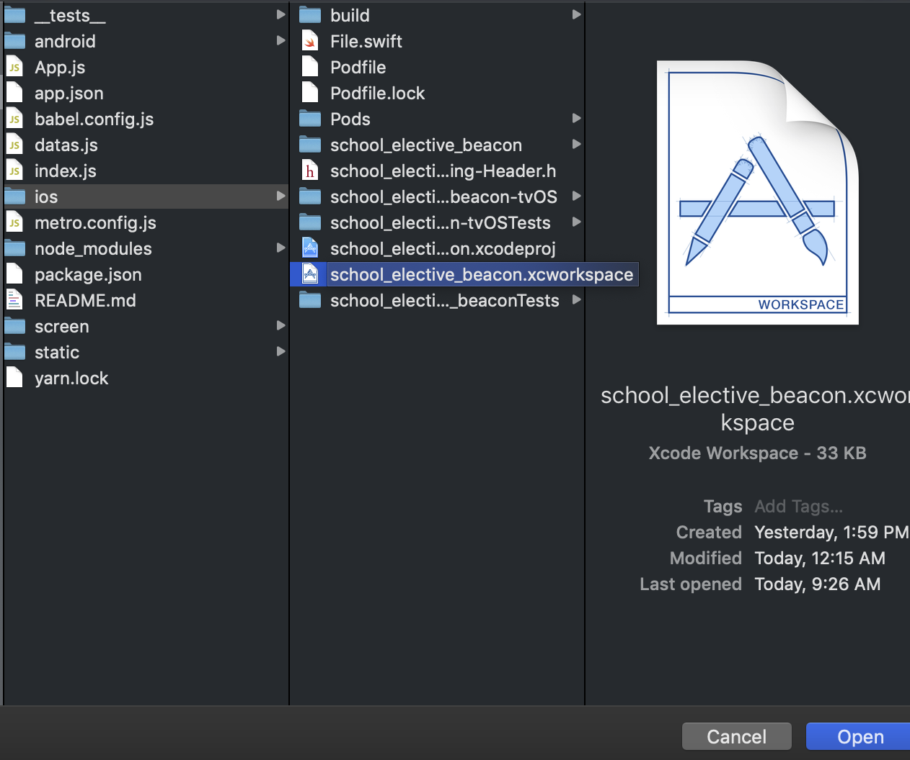

左上邊找到 school_elective_beacon 文件夾

然後再次選擇 school_elective_beacon，按右鍵 new file

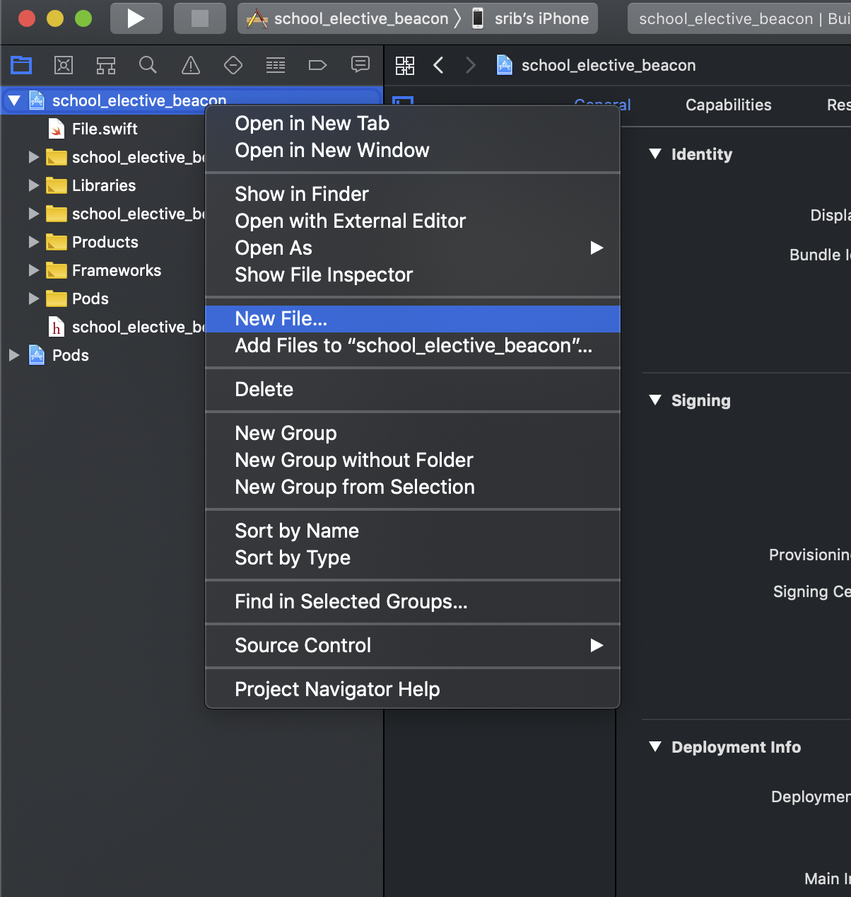

選擇 swift file 然後按 next

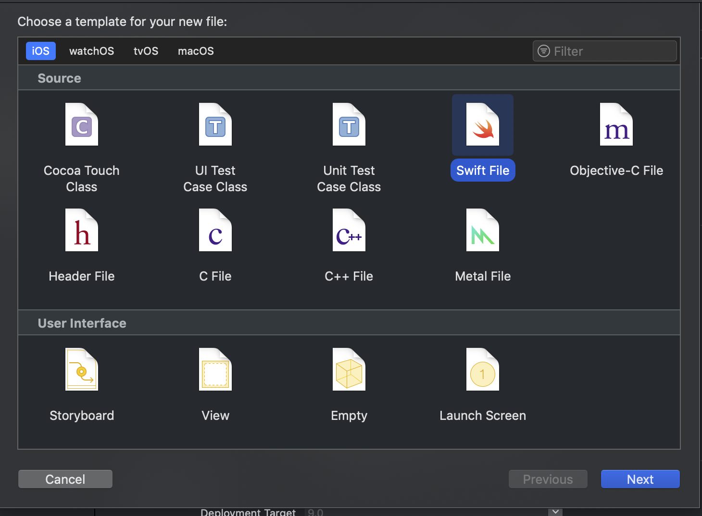

檢查一下路徑是不是 ios 文件夾裏面，如果是就按 create

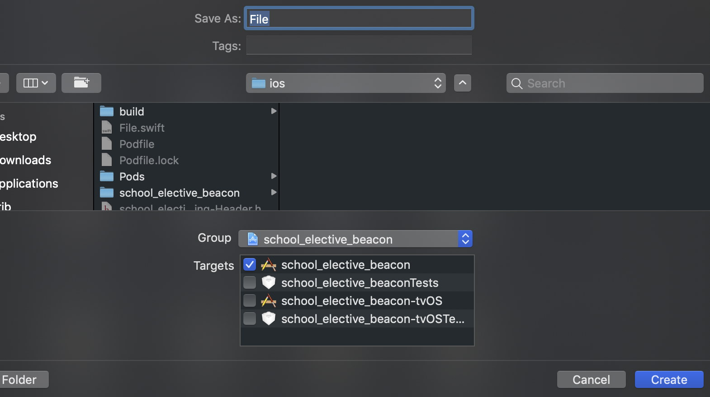

然後會有一個小提示問你要不要  create bridging header,按 create 就可以了

最後就會出現剛剛建的 swift 和 h 字尾的檔案

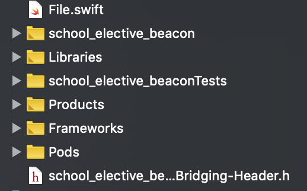

---

在 ios 文件夾下找到 Podfile 檔案(簡稱：ios/Podfile)，然後在 # Pods for school_elective_beacon 下面一行加上以下程式碼，按 command + S

```
pod 'RNVectorIcons', :path => '../node_modules/react-native-vector-icons'
```

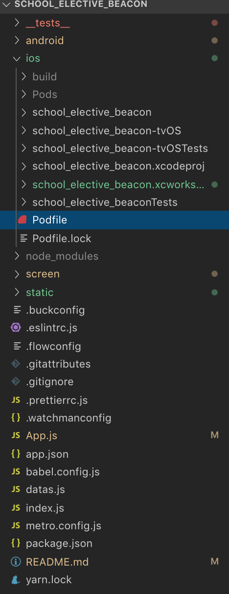
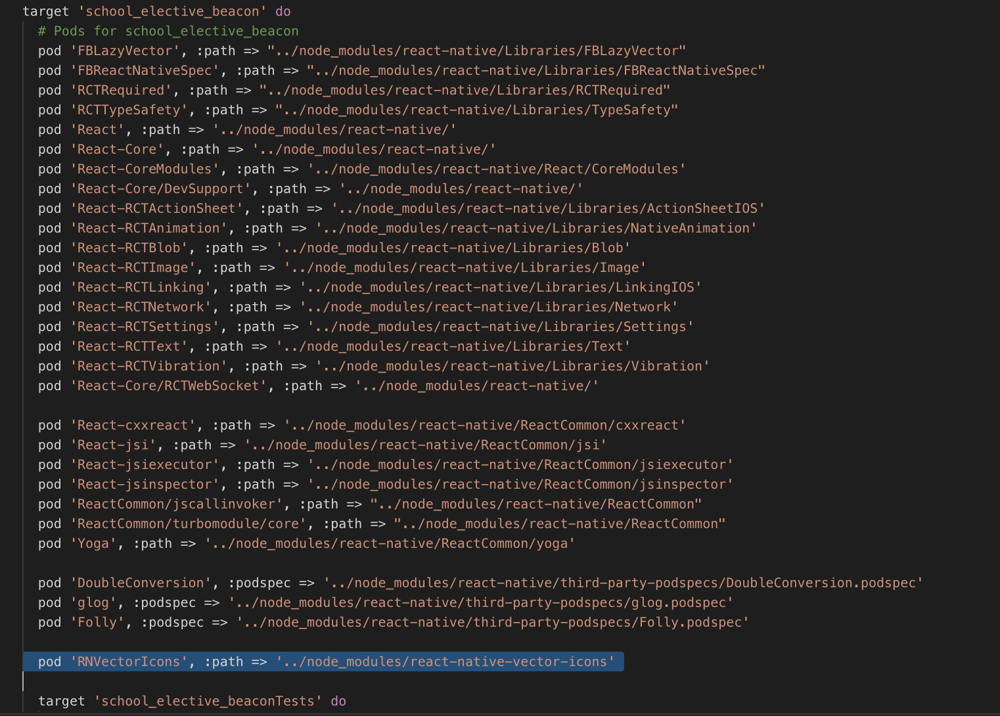

再輸入以下的程式碼

```
pod 'react-native-ble-plx', :path => '../node_modules/react-native-ble-plx'
pod 'react-native-ble-plx-swift', :path => '../node_modules/react-native-ble-plx'
```

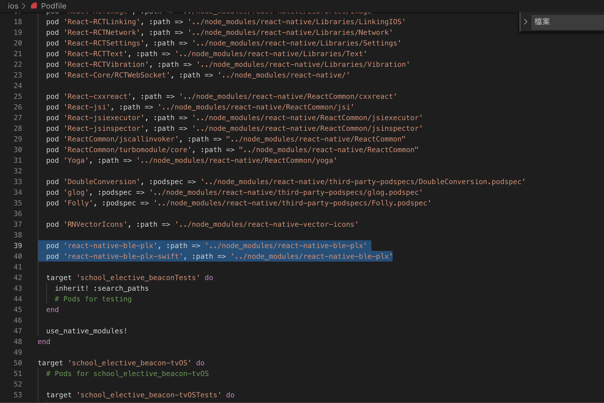

---


然後在 termainl 中輸入以下程式碼，然後按下回車

```
cd ios && pod install
```

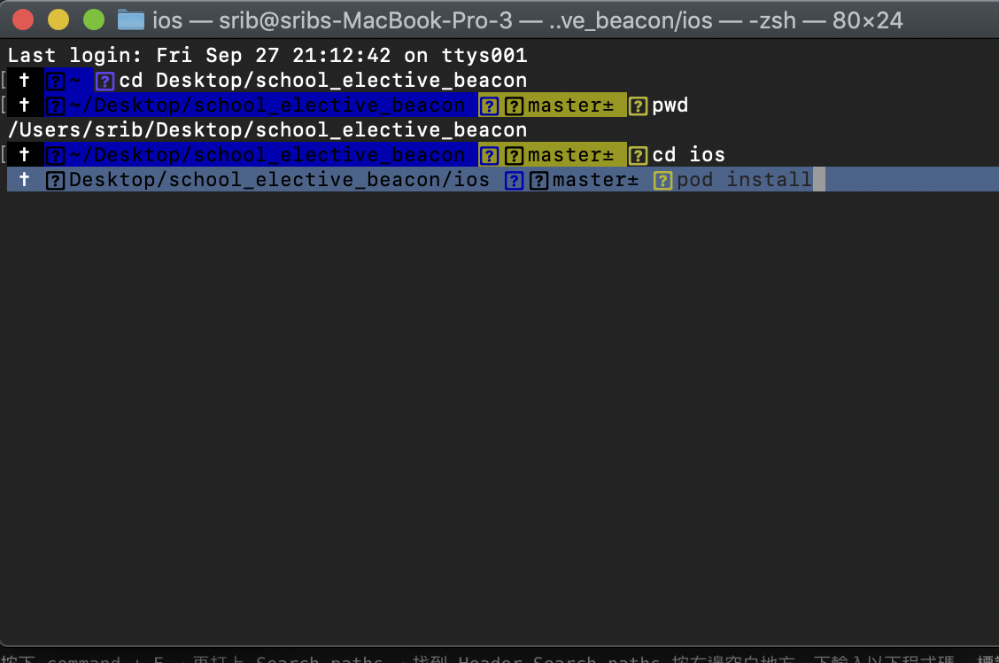

---

打開 xcode 軟件，選擇 ios 裏面的 school_elective_beacon.xcworkspace，左上邊找到 school_elective_beacon 文件夾，然後找到 Libraries 文件夾的 RNiBeacon.xcodeproj 找到 TARGETS 的 RNIBeacon

按下 Build Settings 按下 command + F ，再打上 Search paths ，找到 Header Search paths 按右邊空白地方一下輸入以下程式碼, 標記為 recursive


```
$(SRCROOT)/../../../../ios/Pods/Headers/Public/React-Core
```

```
${SRCROOT}/../../../../ios/Pods/Headers/Public
```

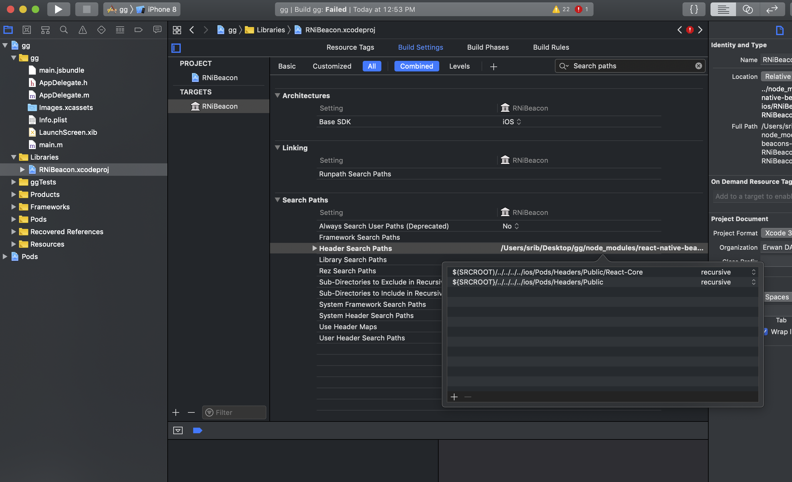

---

在 ios 文件夾下找到 school_elective_beacon 文件夾的 info.plist (簡稱：ios/school_elective_beacon/info.plist)，在 ``<key>UIViewControllerBasedStatusBarAppearance</key><false/>`` 底下輸入以下程式碼，按 command + S ，請檢查在檔案之前有沒有，如果有直接取代就可以了

```
<key>NSBluetoothAlwaysUsageDescription</key>
<string>School Elective Beacon use bluetooth when detect beacons</string>
<key>NSBluetoothPeripheralUsageDescription</key>
<string>School Elective Beacon use bluetooth when detect beacons</string>
<key>NSLocationAlwaysUsageDescription</key>
<string>School Elective Beacon use location when detect beacons</string>
<key>NSLocationWhenInUseUsageDescription</key>
<string>School Elective Beacon use location when detect beacons</string>
<key>UIAppFonts</key>
<array>
  <string>AntDesign.ttf</string>
  <string>Entypo.ttf</string>
  <string>EvilIcons.ttf</string>
  <string>Feather.ttf</string>
  <string>FontAwesome.ttf</string>
  <string>FontAwesome5_Brands.ttf</string>
  <string>FontAwesome5_Regular.ttf</string>
  <string>FontAwesome5_Solid.ttf</string>
  <string>Foundation.ttf</string>
  <string>Ionicons.ttf</string>
  <string>MaterialIcons.ttf</string>
  <string>MaterialCommunityIcons.ttf</string>
  <string>SimpleLineIcons.ttf</string>
  <string>Octicons.ttf</string>
  <string>Zocial.ttf</string>
</array>
```

---

## ANDROID

在 android 文件夾下找到 build.gradle 檔案，然後在入面修改 android 支援的最低版本

將 minSdkVersion 改為1 8

```
android {
    ...
    defaultConfig {
        minSdkVersion 18
        ...
```

在 android 文件夾下找到 app 文件夾的 src 文件夾的 main 文件夾的 AndroidManifest.xml（簡稱：android/app/src/main/AndroidManifest.xml)

新增以下程式碼

```
    ...
    <uses-permission android:name="android.permission.BLUETOOTH"/>
    <uses-permission android:name="android.permission.BLUETOOTH_ADMIN"/>
    <uses-permission-sdk-23 android:name="android.permission.ACCESS_COARSE_LOCATION"/>

    <!-- Add this line if your application always requires BLE. More info can be found on:
         https://developer.android.com/guide/topics/connectivity/bluetooth-le.html#permissions
      -->
    <uses-feature android:name="android.hardware.bluetooth_le" android:required="true"/>
```

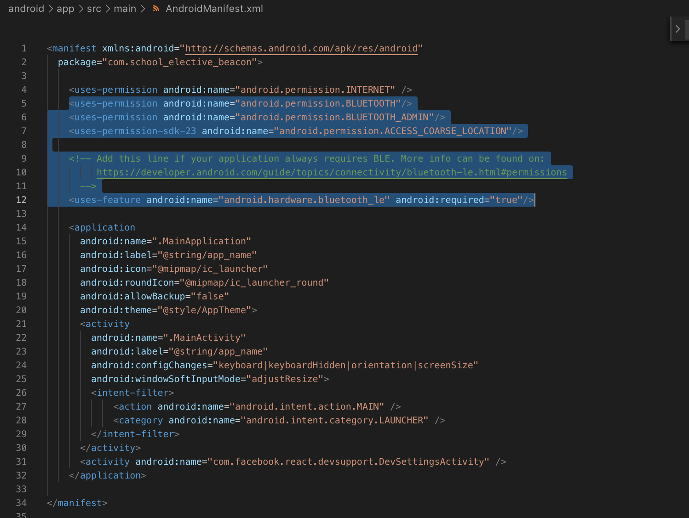

然後在 terminal 輸入

```
yarn add jetifier
```

```
npx jetify
```

---

在 android 文件夾下找到 app 文件夾的 build.gradle(簡稱：android/app/build.gradle)，在 implementation "com.facebook.react:react-native:+"  // From node_modules 底下輸入以下程式碼，按 command + S

```
implementation 'androidx.appcompat:appcompat:1.1.0-rc01'
implementation 'androidx.swiperefreshlayout:swiperefreshlayout:1.1.0-alpha02'
```

然後在最底部再輸入以下程式碼，按 command + S

```
project.ext.vectoricons = [
    iconFontNames: [ 'MaterialIcons.ttf', 'EvilIcons.ttf', 'FontAwesome.ttf' ] // Name of the font files you want to copy
]

apply from: "../../node_modules/react-native-vector-icons/fonts.gradle"
```

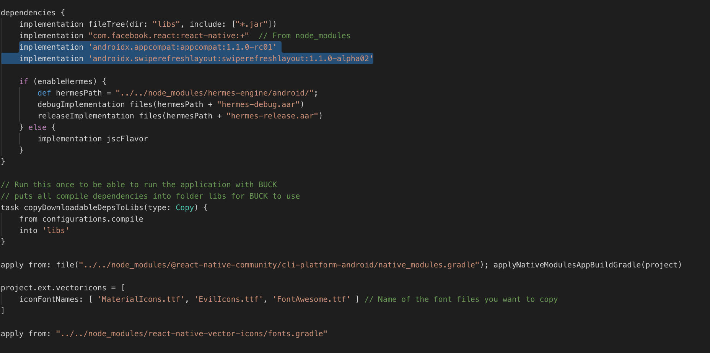

---


找到 android/app/src/main/java/com/school_elective_beacon/MainActivity.java, 在 import com.facebook.react.ReactActivity 底下輸入以下程式碼

```
import com.facebook.react.ReactActivityDelegate;
import com.facebook.react.ReactRootView;
import com.swmansion.gesturehandler.react.RNGestureHandlerEnabledRootView;
```

再在 return "school_elective_beacon" } 底下輸入以下程式碼，按 command + S
```
 @Override
 protected ReactActivityDelegate createReactActivityDelegate() {
    return new ReactActivityDelegate(this, getMainComponentName()) {
      @Override
      protected ReactRootView createRootView() {
       return new RNGestureHandlerEnabledRootView(MainActivity.this);
      }
    };
  }
```
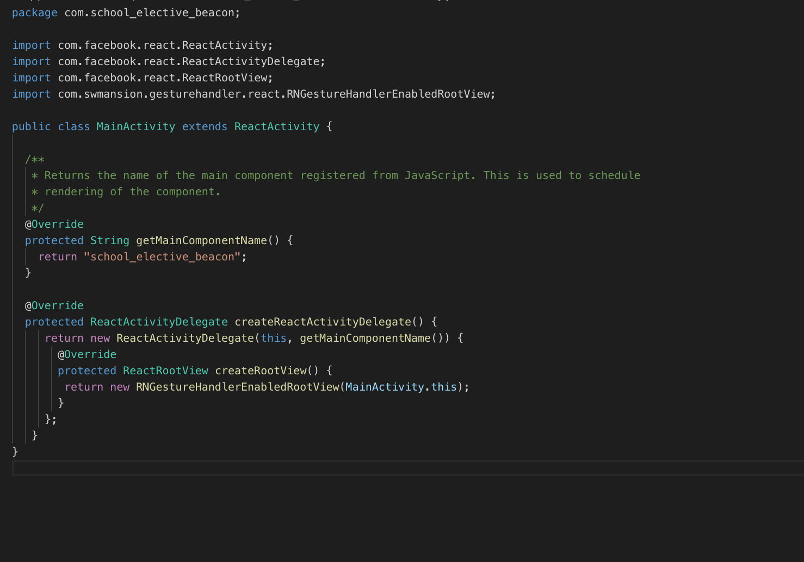

## 體驗App的結果

把 App 資料夾的 App.js 文檔的代碼，取代自己項目根目錄的 App.js, 再將 screen 資料夾, datas.js 和 homeDatas.js 文檔複製去根目錄底下。

然後打開 xcode , 選擇自己的 probject, 

在 xcode 中檢查一下有沒有 team

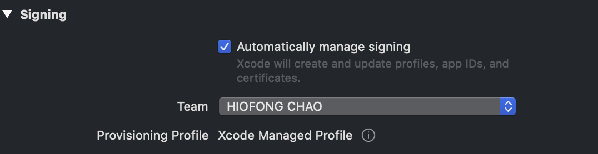

然後選擇自己的手機再按 build and then run the current scheme

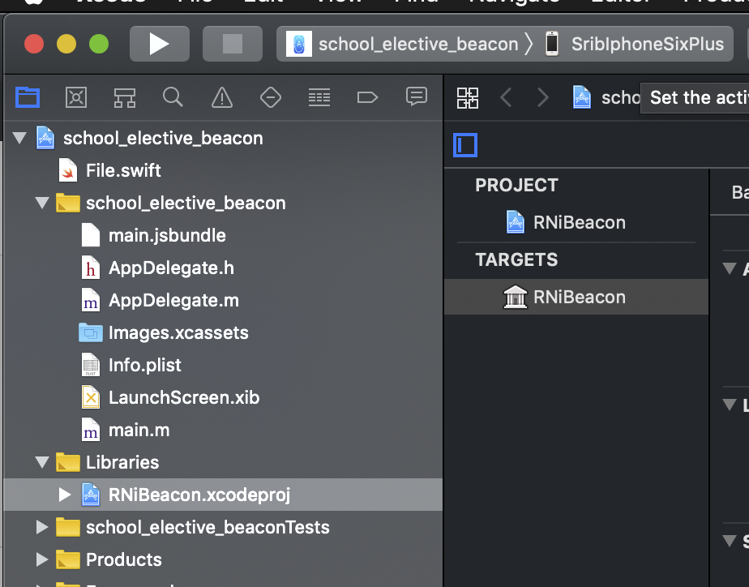
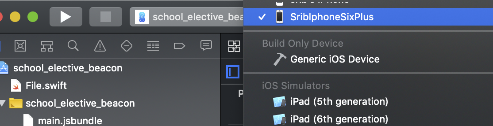
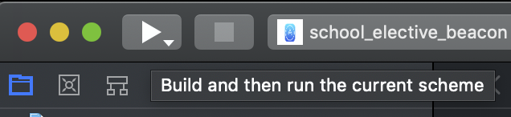

---

## 生成app上傳

## iosbundle

檢查一下在 ios Folder 底下有沒有 bundle 檔案，沒有的話就建立。

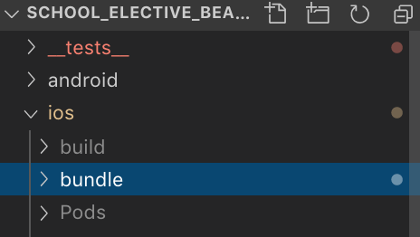

然後在 termainl 根目錄中輸入以下程式碼，然後按下回車

```
react-native bundle --entry-file index.js --platform ios --dev false --bundle-output ./ios/bundle/index.ios.jsbundle --assets-dest ./ios/bundle
```

在 appstore connect 生成一個 app, 套件識別碼是唯一的，要和 xcode bundle id 一樣, sku 取一個自己喜歡的

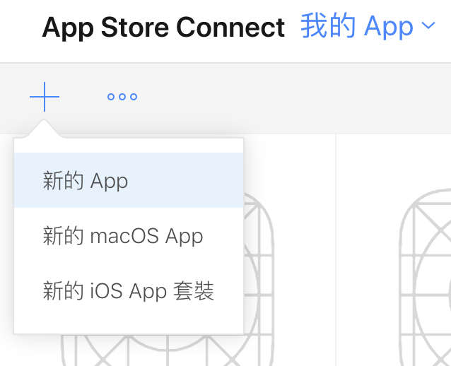
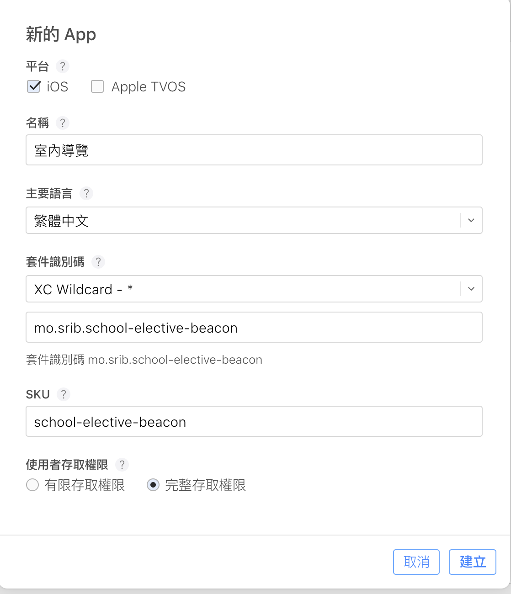
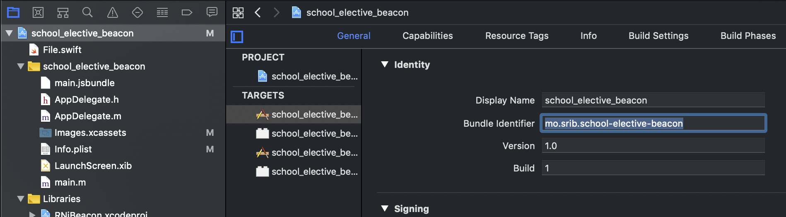

在 xcode 中檢查一下有沒有 team


要有 AppIcon

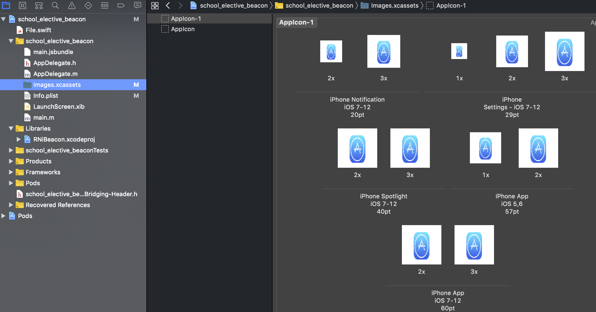
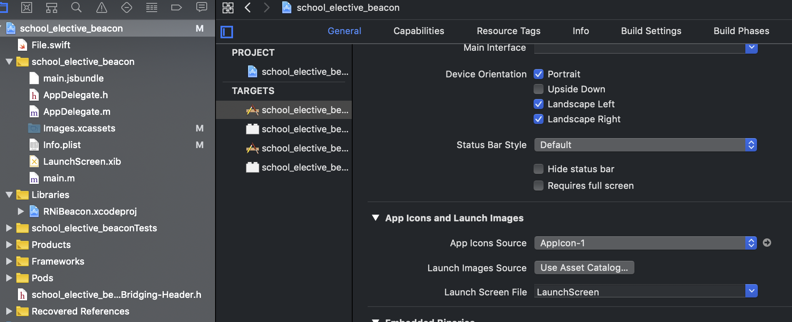
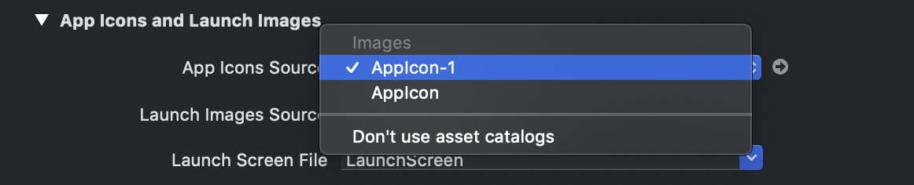

在 Product 的 Archive 按了後，就按右邊的藍 button 一直按 next push 上去就可以了。

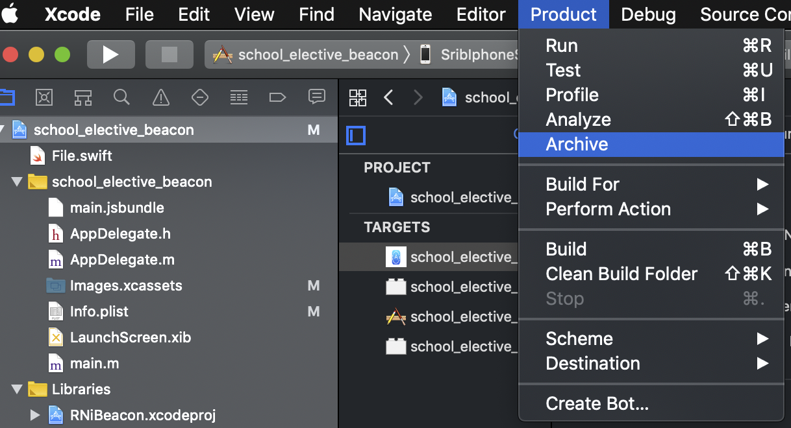
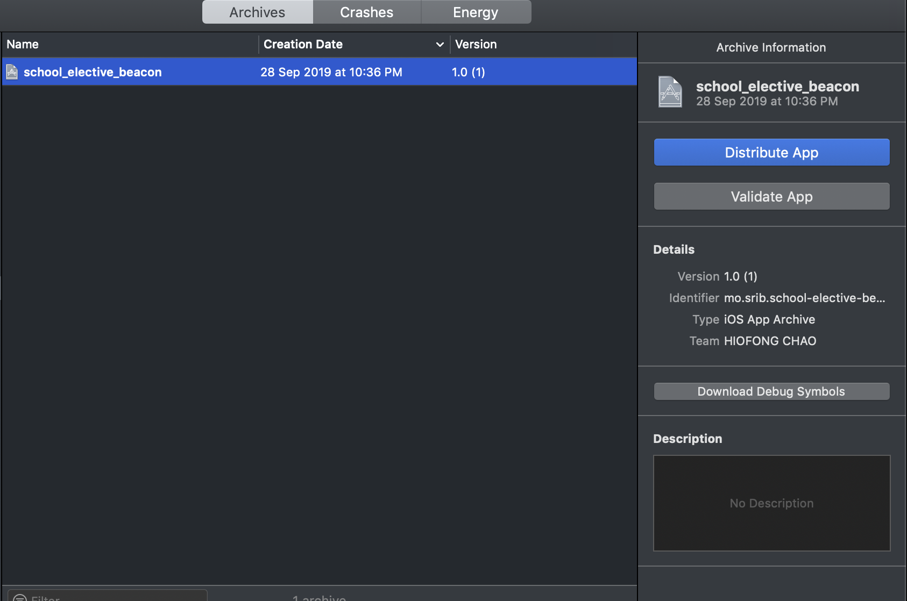
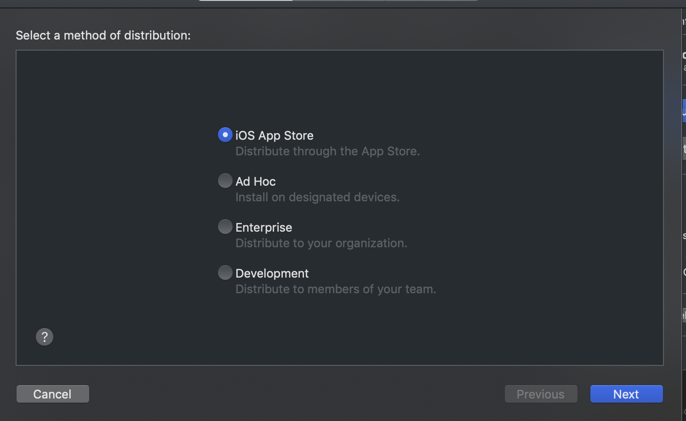
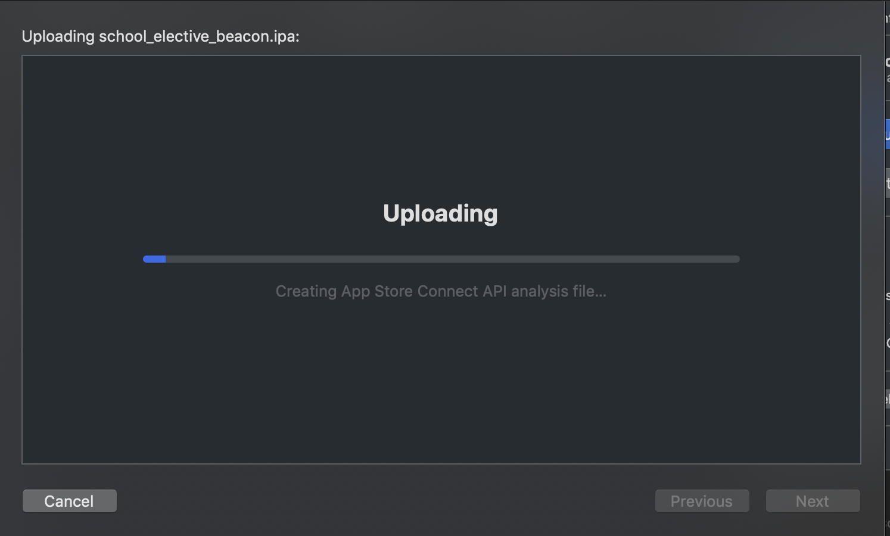
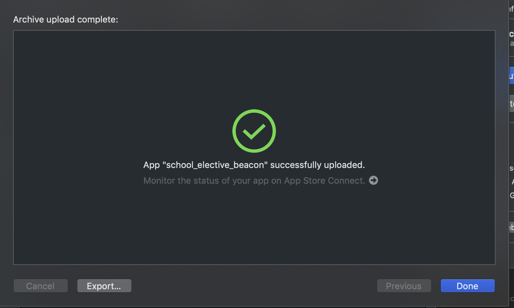

最後可以在 appstore connect 見到自己的 app，如要上架要填資料

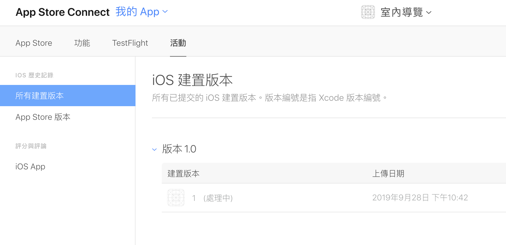

---

## androidbundle

- [網站](https://facebook.github.io/react-native/docs/signed-apk-android)

---
